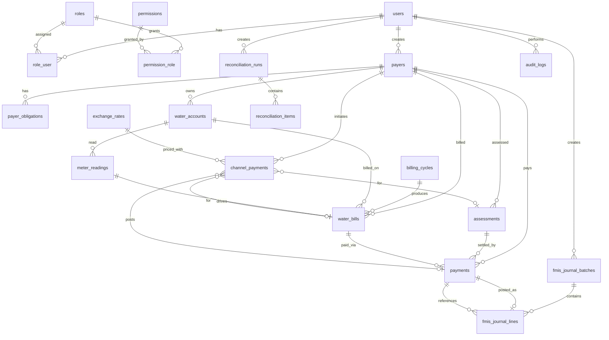
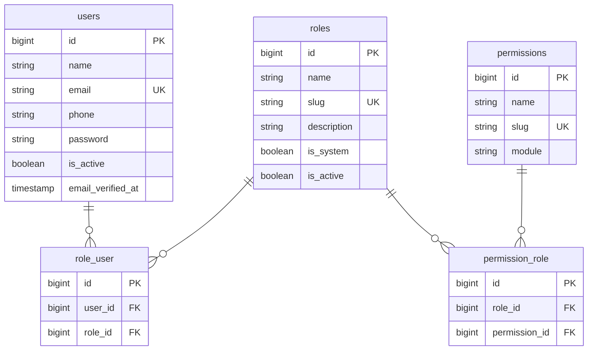
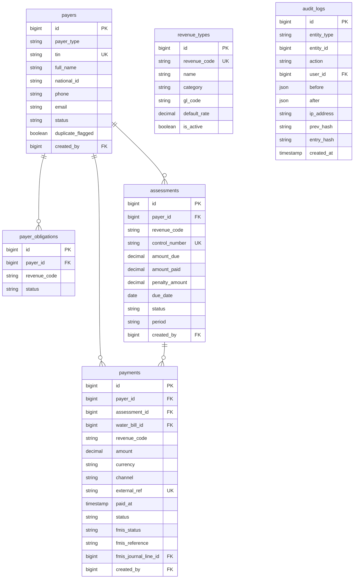
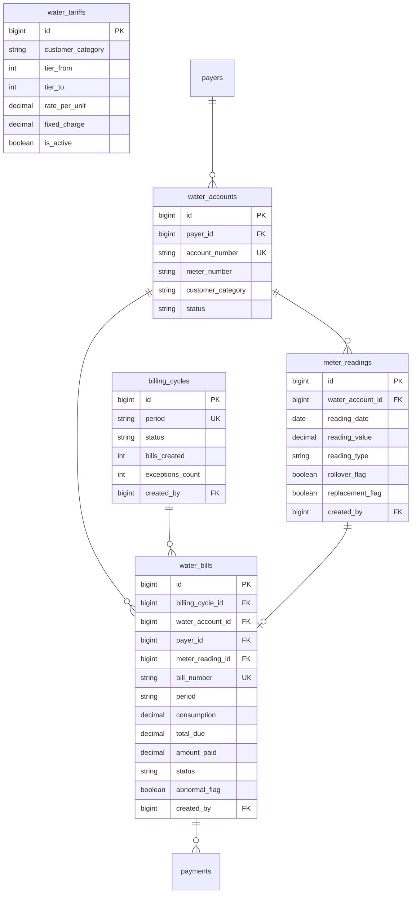
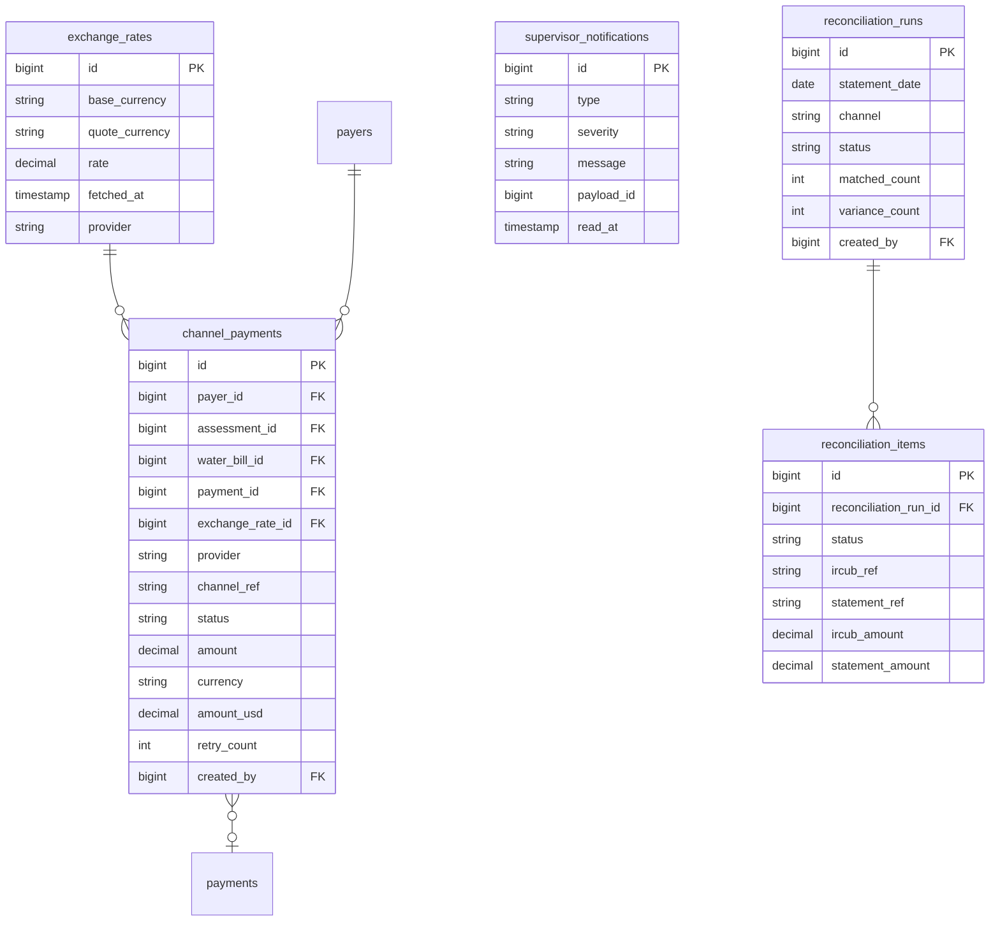
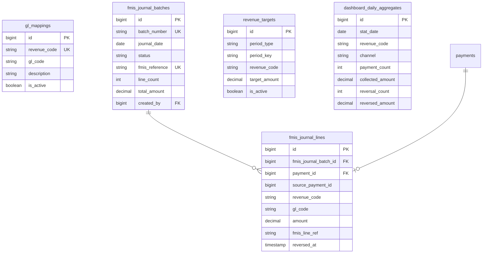

# IRCUB Entity Relationship Diagram

Logical ERD for the PostgreSQL schema used by the IRCUB POC.  
Rendered with Mermaid (GitHub / VS Code / most Markdown previews).

Framework tables (`cache`, `jobs`, `sessions`, `password_reset_tokens`, `personal_access_tokens`) are omitted for clarity.

---

## Overview (core domain)

---

## 1. Identity & access

---

## 2. Registry, revenue & audit

Logical (non-FK) links: `assessments.revenue_code` / `payments.revenue_code` → `revenue_types.revenue_code`.

---

## 3. Water billing

`water_tariffs` is keyed by `customer_category` (matched to `water_accounts.customer_category` at billing time).

---

## 4. Payment channels & reconciliation

---

## 5. FMIS posting & dashboard

Traceability path: **Payment → FMIS journal line → FMIS journal batch → mock FMIS reference**.

`dashboard_daily_aggregates` is a **pre-aggregated** table rebuilt from `payments` (not a live FK graph).

---

## Notes

| Topic | Detail |
|---|---|
| Engine | PostgreSQL 16 |
| Auth tokens | Laravel Sanctum (`personal_access_tokens`) |
| Soft constraints | Some links use business keys (`revenue_code`) rather than FKs for flexibility |
| Seed data | `php artisan migrate:fresh --seed` (includes dashboard history) |
| Migrations | `backend/database/migrations/` |
